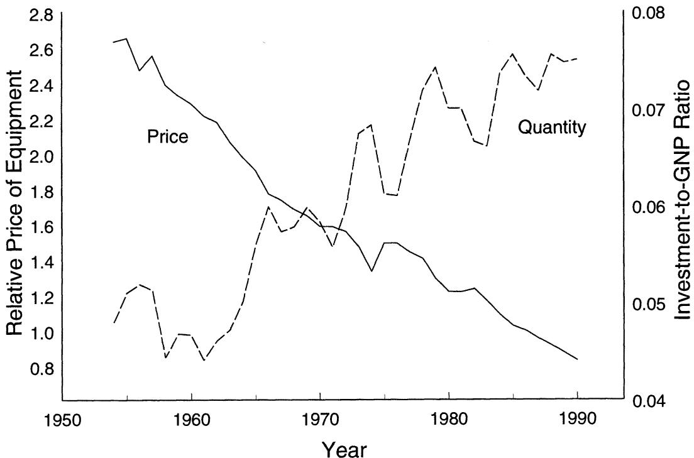
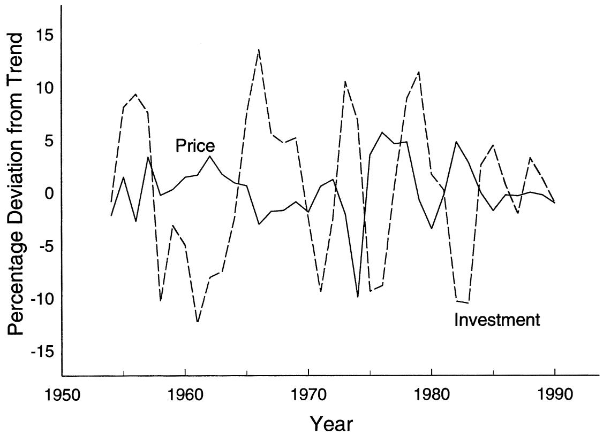
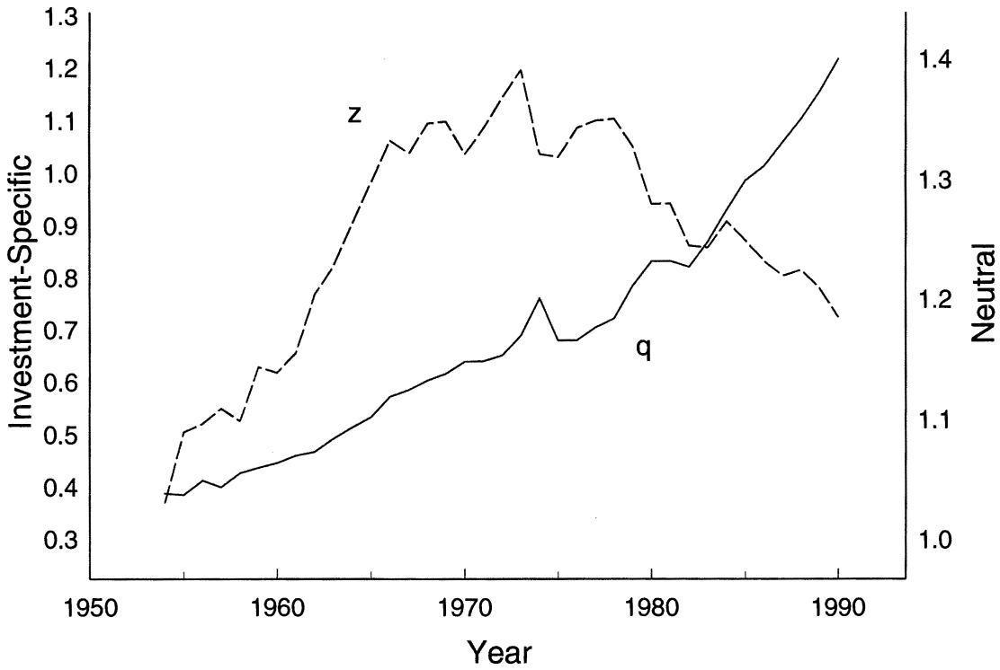
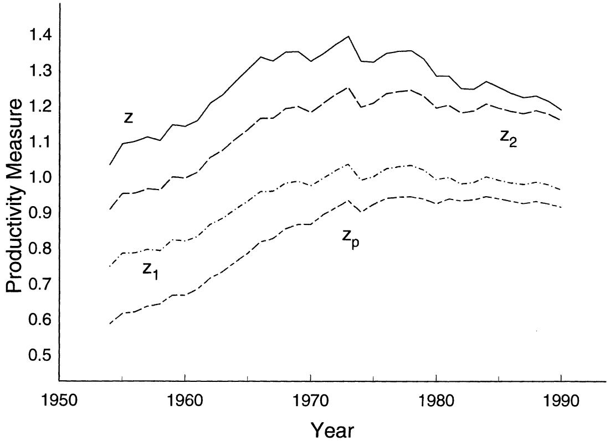
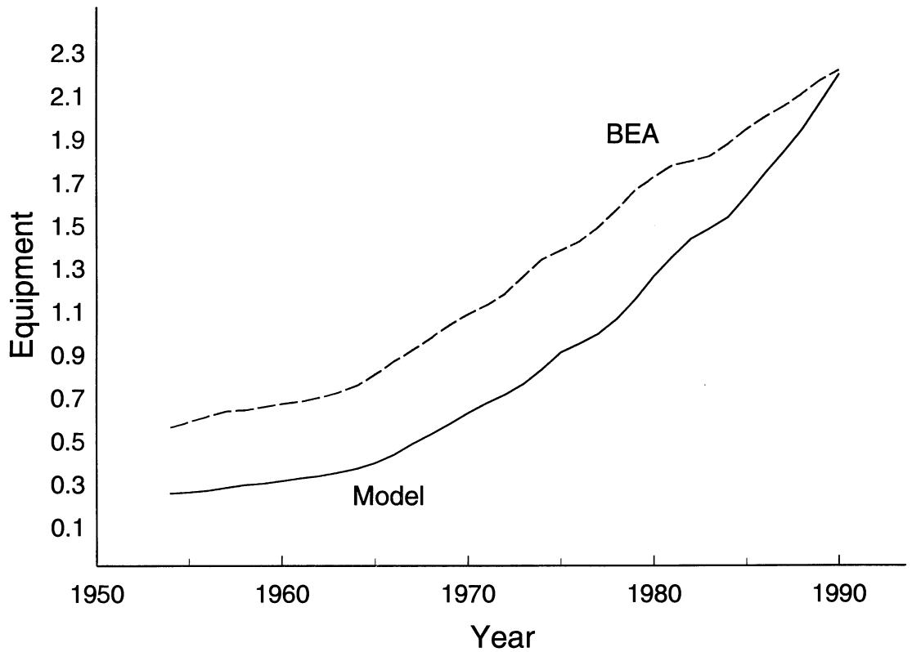
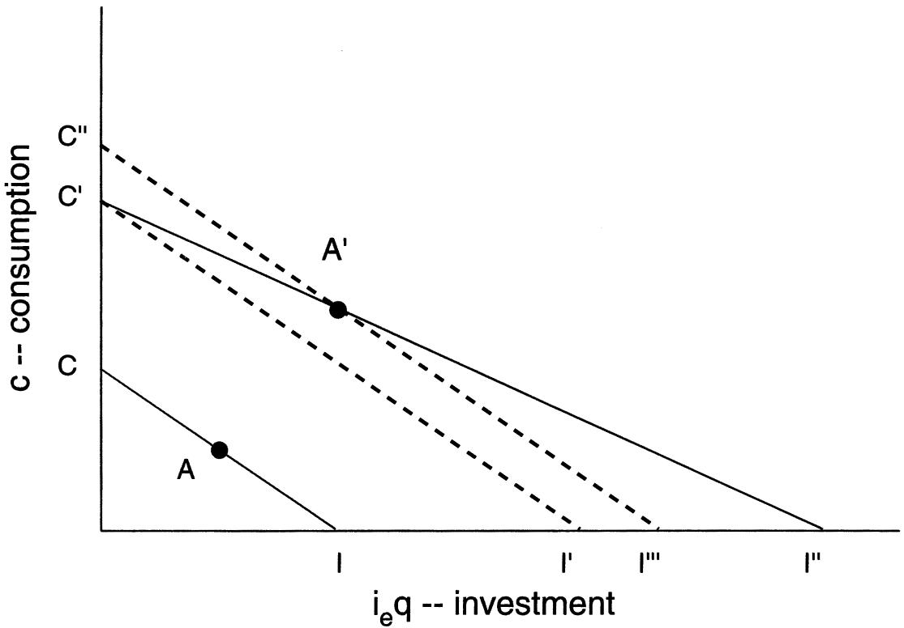

# Long-Run Implications of Investment-Specific Technological Change

**Jeremy Greenwood, Zvi Hercowitz, Per Krusell**

*American Economic Review, Vol. 87, No. 3 (Jun., 1997), pp. 342-362*

The role that investment-specific technological change played in generating post-war U.S. growth is investigated here. The premise is that the introduction of new, more efficient capital goods is an important source of productivity change, and an attempt is made to disentangle its effects from the more traditional Hicks-neutral form of technological progress. The balanced growth path for the model is characterized and calibrated to U.S. National Income and Product Account (NIPA) data. The quantitative analysis suggests that investment-specific technological change accounts for the major part of growth. (JEL E13, O30, O41, O47)

The price and quantity series for equipment investment in the postwar United States display two striking features:

(1) Low frequency: The relative price of equipment has declined at an average annual rate of more than 3 percent. Simultaneously, the equipment-to-GNP ratio has increased substantially. Both patterns, which are fairly dramatic, are portrayed in Figure 1.   
(2) High frequency: There is a negative correlation (-0.46) between the detrended relative price of new equipment and new equipment investment. This is shown in Figure 2. $^{1}$

The negative comovement between price and quantity at both frequencies can be interpreted as evidence that there has been significant technological change in the production of new \* Greenwood: Department of Economics, University of Rochester, Rochester, NY 14627; Hercowitz: Department of Economics, Tel Aviv University, Ramat Aviv 69978, Israel; Krusell: Department of Economics, University of Rochester, Rochester, NY 14627, Institute for International Economic Studies, and CEPR. Part of this research was circulated earlier under the title “Macroeconomic Implications of Investment-Specific Technological Change.” The work here has benefited enormously from the detailed comments of Charles Hulten, Edward Prescott, Paul Romer, and an anonymous referee. We thank them all.
¹ For the quantity series standard NIPA data is used. The price series are based on data in Robert J. Gordon (1990). See Appendix A for more detail on the data series.

equipment. Technological advances have made equipment less expensive, triggering increases in the accumulation of equipment both in the short and long run. Concrete examples in support of this interpretation abound: new and more powerful computers, faster and more efficient means of telecommunication and transportation, robotization of assembly lines, and so on.

These observations bring to the fore the following question: What is the quantitative role of investment-specific technological change as an engine of growth? To address this question, a simple vintage capital model is embedded into a general equilibrium framework. The main feature of the model is that the production of capital goods becomes increasingly efficient with the passage of time. By analyzing the balanced growth path for the model, the contribution of investment-specific technological change to U.S. postwar economic growth is gauged. The balanced growth path for the model has the feature that both the stock of equipment and new equipment investment (measured in quality-adjusted units) grow at a higher rate than output. The upshot of the analysis is that investment-specific technological change explains close to 60 percent of the growth in output per hours worked. Residual, neutral productivity change then accounts for the remaining 40 percent. Additionally, a striking result from this growth-accounting exercise is that the time series for residual productivity change has regressed sharply and continuously since the early 1970's. The conclusion from this exercise seems to be that once the increased productivity of the capital goods-producing sector is taken into account, the much-discussed productivity slowdown becomes all the more dramatic. $^{2}$

  
FIGURE 1. INVESTMENT IN EQUIPMENT

The current study is a related to work by Charles R. Hulten (1992), which also stresses capital-embodied technological change as key to long-run productivity movements. Both works use Gordon's (1990) price index, which was constructed precisely to capture the increased productivity in the production of new capital goods. A key distinction between the two papers, however, is the adoption of a general equilibrium approach here. In line with conventional growth accounting, Hulten (1992)

$^{2}$ The role that investment-specific technological change plays in generating business-cycle fluctuations is addressed in Greenwood et al. (1994).

uses an aggregate production function to decompose output growth into technological change and changes in inputs, in particular capital accumulation. Clearly, though, a large part of capital stock growth reflects the endogenous response of capital accumulation to technological change. By taking a general equilibrium approach, the current analysis can go one step further: inferences can be made about how much of capital stock growth was due to investment-specific technological change versus neutral productivity growth. The point that part of observed growth in capital is the result of technological change, and that growth-accounting procedures should adjust for this, also has been recognized in work by Hulten (1979).

Additionally, as highlighted by Hulten (1992), there is a controversy in the growth-accounting literature over whether or not GNP should be adjusted upwards to reflect “quality improvements” in new capital goods. The general equilibrium approach taken here provides a decisive answer to this question: it should not be. This finding is important since the quality adjustment significantly reduces the role ascribed to investment-specific, as opposed to neutral, productivity change in explaining U.S. output growth.

  
FIGURE 2. INVESTMENT IN EQUIPMENT—H.P. DETRENDED

The paper is organized as follows: Section I presents the model and provides a characterization of its balanced growth path. The model is calibrated to the National Income and Products Accounts in Section II. The contribution of investment-specific technological change to postwar U.S. economic growth then is assessed. Section III compares the current analysis with conventional growth accounting. Some pitfalls of using NIPA data to assess growth models are discussed in Section IV. Based on the findings presented in Section II, some potentially interesting avenues for future empirical research on growth are suggested in Section V. In particular, some ways of endogenizing investment-specific technological change are discussed. Finally, in Section VI some concluding remarks are made.

# I. The Model

# A. The Economic Environment

Consider an economy inhabited by a representative agent who maximizes the expected value of his lifetime utility as given by

$$
E \left[ \sum_ {t = 0} ^ {\infty} \beta^ {t} U (c _ {t}, l _ {t}) \right], \tag {1}
$$

with

$$
U (c, l) = \theta \ln c + (1 - \theta) \ln (1 - l), \tag {2}
$$

$$
0 <   \theta <   1,
$$

where c and l represent consumption and labor. $^{3}$

The production of final output y requires the services of labor l, and two types of capital: equipment $k_{e}$ , and structures $k_{s}$ . Production is undertaken in accordance with

$$
y = z F (k _ {e}, k _ {s}, l) = z k _ {e} ^ {\alpha_ {e}} k _ {s} ^ {\alpha_ {s}} l ^ {1 - \alpha_ {e} - \alpha_ {s}}, \tag {3}
$$

$$
0 <   \alpha_ {e}, \alpha_ {s}, \alpha_ {e} + \alpha_ {s} <   1.
$$

The variable z is a measure of total-factor, or neutral, productivity. Final output can be used for three purposes: consumption c, investment in structures $i_{s}$ , and investment in equipment $i_{e}$ :

$$
y = c + i _ {e} + i _ {s}. \tag {4}
$$

Note that the theoretical constructs are normalized so that both output and investment are measured in units of consumption.

Structures can be produced from final output on a one-to-one basis. The stock of structures evolves according to

$$
k _ {s} ^ {\prime} = (1 - \delta_ {s}) k _ {s} + i _ {s}, 0 <   \delta_ {s} <   1. \tag {5}
$$

The story is different for equipment. The accumulation equation for equipment is expressed as

$$
k _ {e} ^ {\prime} = (1 - \delta_ {e}) k _ {e} + i _ {e} q, 0 <   \delta_ {e} <   1. \tag {6}
$$

The most important aspect of this equation is the inclusion of the factor q that represents the current state of the technology for producing equipment. It determines the amount of equipment that can be purchased for one unit of output. Changes in q formalize the notion of investment-specific technological change. Assume that both q and z follow first-order Markov processes that display average growth rates of $\gamma_{q}$ and $\gamma_{z}$ , respectively. Observe that investment-specific technological change is assumed to affect equipment only. The motivation for this is empirical. First, the relative price of structures appears to be stationary over time in the U.S. data, as does the structures-to-GNP ratio. Second, casual observation suggests that there is less productivity change in structures than in equipment. In equations (5) and (6), $\delta_{s}$ and $\delta_{e}$ represent the rates of physical depreciation on structures and equipment.

Finally, there is also a government present in the economy. It levies taxes on income earned by labor and capital at the rates $\tau_{l}$ and $\tau_{k}$ . The revenue raised by the government in each period is rebated back to agents in the form of lump-sum transfer payments in the amount $\tau$ . The government's budget constraint is

$$
\tau = \tau_ {k} (r _ {e} k _ {e} + r _ {s} k _ {s}) + \tau_ {l} w l, \tag {7}
$$

where $r_{e}$ , $r_{s}$ , and w represent the returns for the services from equipment, structures and labor. The inclusion of income taxation in the framework is important for the quantitative analysis because of the significant effect that it has on equilibrium capital formation.

Notice that movements in q can be interpreted in two different ways. First, 1/q could be thought of as representing the cost of producing a new unit of equipment in terms of final output. This cost declines over time. Second, one could imagine that in each period a new vintage of equipment is produced. The productivity of a new unit of equipment is given by q, where q increases over time. The cost of producing a new unit of equipment is fixed over time, however, at one unit of final output. This is often labeled capital-embodied technological change. This equivalent representation of the model is presented in Appendix B. What both of these forms of technological change have in common is that they are specific to the production of investment goods, which is why the term investment-specific is chosen here. Technological change makes new equipment either less expensive or better than old equipment, allowing for increased consumption. Note that investment-specific technological change requires investment in order to affect output, whereas neutral technological change does not.

A key variable in the model is the equilibrium price for a unit of newly produced equipment, using consumption goods as the numéraire. In the framework developed, this price corresponds on the one hand to the inverse of the investment-specific technology shock q. On the other, it is the direct theoretical counterpart to a relative price series for new equipment that is computed using a price index for quality-adjusted equipment constructed by Gordon (1990). $^{4}$ Hence, investment-specific technological change can be identified here with a relative price index based on Gordon's price series.

# B. Competitive Equilibrium

The competitive equilibrium under study will now be formulated. The aggregate state of the world is described by $\lambda = (s, z, q)$ , where $s \equiv (k_e, k_s)$ . Assume that the equilibrium wage and rental rates $w$ , $r_e$ , and $r_s$ , and individual transfer payments $\tau$ all can be expressed as functions of the state of the world $\lambda$ as follows: $w = W(\lambda)$ , $r_e = R_e(\lambda)$ , $r_s = R_s(\lambda)$ , $\tau = T(\lambda)$ . Finally, suppose that the two capital stocks evolve according to $k_e' = K_e(\lambda)$ and $k_s' = K_s(\lambda)$ . Hence, the law of motion for $s$ is $s' = S(\lambda) \equiv (K_e(\lambda), K_s(\lambda))$ . The optimization problems facing households and firms can now be cast. Of course, all agents take the evolution of $s$ , as governed by $s' = S(s, z, q)$ , to be exogenously given.

1. The Household.—The dynamic program problem facing the representative household is

$$
\mathrm{P} (1) \quad V (k _ {e}, k _ {s}; s, z, q)
$$

$$
= \max _ {c, k _ {e} ^ {\prime}, k _ {s} ^ {\prime}, l} \left\{U (c, l) \right.
$$

$$
\left. + \beta E [ V (k _ {e} ^ {\prime}, k _ {s} ^ {\prime}; s ^ {\prime}, z ^ {\prime}, q ^ {\prime}) ] \right\}
$$

$^{4}$ See Appendix A for a more detailed discussion on this.

subject to

$$
\begin{array}{l} c + k _ {e} ^ {\prime} / q + k _ {s} ^ {\prime} \\ = (1 - \tau_ {k}) \left[ R _ {e} (\lambda) k _ {e} + R _ {s} (\lambda) k _ {s} \right] \\ + (1 - \tau_ {l}) W (\lambda) l \\ + \left(1 - \delta_ {e}\right) k _ {e} / q + \left(1 - \delta_ {s}\right) k _ {s} + T (\lambda), \\ \end{array}
$$

and $s' = S(\lambda)$ .

2. The Firm.—The maximization problem of the firm is

$$
\mathrm{P} (2) \quad \max _ {\tilde {k} _ {e}, \tilde {k} _ {s}, l} \pi_ {y} = z F (\tilde {k} _ {e}, \tilde {k} _ {s}, l) - R _ {e} (\lambda) \tilde {k} _ {e}
$$

$$
- R _ {s} (\lambda) \tilde {k} _ {s} - W (\lambda) l.
$$

Due to the constant returns to scale assumption, the firm makes zero profits in each period; i.e., $\max \pi_{y} = 0$ .

3. Definition of Equilibrium.—A competitive equilibrium is a set of allocation rules $c = C(\lambda)$ , $k_{e}^{\prime} = K_{e}(\lambda)$ , $k_{s}^{\prime} = K_{s}(\lambda)$ , and $l = L(\lambda)$ , a set of pricing and transfer functions $w = W(\lambda)$ , $r_{e} = R_{e}(\lambda)$ , $r_{s} = R_{s}(\lambda)$ , and $\tau = T(\lambda)$ , and an aggregate law of motion for the capital stocks $s^{\prime} = S(\lambda)$ such that:

(i) Households solve problem P(1), taking as given the aggregate state of the world $\lambda = (s, z, q)$ and the form of the functions $W(\cdot), R_e(\cdot), R_s(\cdot), T(\cdot)$ , and $S(\cdot)$ , with the equilibrium solution to this problem satisfying $c = C(\lambda)$ , $k_e' = K_e(\lambda)$ , $k_s' = K_s(\lambda)$ , and $l = L(\lambda)$ .

(ii) Firms solve the problem $\mathrm{P}(2)$ , given $\lambda$ and the functions $R_{e}(\cdot), R_{s}(\cdot)$ , and $W(\cdot)$ , with the equilibrium solution to this problem satisfying $\tilde{k}_{e} = k_{e}, \tilde{k}_{s} = k_{s}$ , and $l = L(\lambda)$ .

(iii) The economywide resource constraint (4) holds each period so that

$$
c + i _ {e} + i _ {s} = z F (k _ {e}, k _ {s}, l),
$$

where

$$
i _ {s} = k _ {s} ^ {\prime} - (1 - \delta_ {s}) k _ {s},
$$

and

$$
i _ {e} = [ k _ {e} ^ {\prime} - (1 - \delta_ {e}) k _ {e} ] / q.
$$

# C. Balanced Growth

The balanced growth path for a deterministic version of the above model now will be characterized. In particular, suppose that z and q grow at the (gross) rates $\gamma_{z}$ and $\gamma_{q}$ , and let $z_{t} = \gamma_{z}^{t}$ and $q_{t} = \gamma_{q}^{t}$ . Clearly, along a balanced growth path, output, consumption, investment, and the capital stocks all will grow, and the amount of labor employed will remain constant. It is convenient to transform the problem into one that renders all variables constant in the steady state.

To find the appropriate transformation, observe that the resource constraint (4) implies that output, consumption, and investment all have to grow at the same rate, say g, along a balanced growth path. Then, from the accumulation equation (5) for structures it follows that the stock of structures also has to grow at rate g. Equipment, however, grows faster. From (6) its growth rate $g_{e}$ equals $g\gamma_{q}$ . Finally, the form of the production function (3) implies that $g = \gamma_{z}g_{e}^{\alpha_{e}}g^{\alpha_{s}}$ . Thus, the following restrictions are imposed on balanced growth:

$$
g = \gamma_ {z} ^ {1 / (1 - \alpha_ {e} - \alpha_ {s})} \gamma_ {q} ^ {\alpha_ {e} / (1 - \alpha_ {e} - \alpha_ {s})}, \tag {8}
$$

and

$$
g _ {e} = \gamma_ {z} ^ {1 / (1 - \alpha_ {e} - \alpha_ {s})} \gamma_ {q} ^ {(1 - \alpha_ {s}) / (1 - \alpha_ {e} - \alpha_ {s})}. \tag {9}
$$

Given a conjectured growth rate for all variables, one can impose a transformation that will render them stationary. Specifically, first define $\hat{x}_{t}=x_{t}/g^{t}$ for $x_{t}=y_{t}$ , $c_{t}$ , $i_{et}$ , $i_{st}$ , and $k_{st}$ ; second, set $\hat{k}_{et}=k_{et}/g_{e}^{t}$ , $\hat{q}_{t}=q_{t}/\gamma_{q}^{t}$ ; and finally, let $\hat{z}_{t}=z_{t}/\gamma_{z}^{t}$ . The household's and firm's choice problems P(1) and P(2), along with the resource constraint (4), can be rewritten in terms of these transformed variables. A globally stable steady state exists for the transformed model which corresponds to an unbounded growth path for the original model. $^{5}$

It follows from the analysis above that the stock of equipment grows over time at a higher rate than output if the relative price of new equipment in terms of output, or 1/q, is declining secularly. Thus, the model conforms qualitatively with the long-run observations presented in the introduction. It is also straightforward to check that the properties of the standard neoclassical growth model such as a constant steady-state real interest rate, constant capital and labor shares of income, and constant consumption- and structures-to-output ratios, are preserved here.

It is interesting to observe that the rental price of a unit of equipment, $zF_{1}(k_{e}, k_{s}, l) = \alpha_{e}(k_{s}/k_{e})^{\alpha_{s}}(z^{1/(1-\alpha_{e}-\alpha_{s})}l/k_{e})^{1-\alpha_{e}-\alpha_{s}}$ , must be continually falling along a balanced growth path since both $k_{s}/k_{e}$ and $z^{1/(1-\alpha_{e}-\alpha_{s})}l/k_{e}$ are declining. It is straightforward to calculate that the rental price of equipment falls along a balanced growth path at the rate $1/\gamma_{q}$ —assuming that z is constant. How, then, can the real interest rate remain constant? The answer is that the cost of a unit of equipment in terms of consumption goods, or 1/q, is also declining over time at rate $1/\gamma_{q}$ . Thus, the return from investing a unit of consumption goods in equipment, or $zF_{1}(k_{e}, k_{s}, l)q$ , remains constant over time.

# II. The Role of Investment-Specific Technological Change in Economic Growth

How important quantitatively is investment-specific change for U.S. economic growth? What is the impact of other sources of technological progress? By interpreting U.S. post-war data through the above framework, the contribution of these different sources of technological change can be quantitatively assessed.

# A. Matching the Model with the Data

Care must be taken when matching up the theoretical constructs of the model with their counterparts in the U.S. data. First, the variables in the model's resource constraint, namely $y$ , $c$ , $i_e$ , and $i_s$ , are matched up in that data with the corresponding nominal variables from the NIPA divided through by a common price deflator. A natural such price in this context is the consumption deflator of nondurable goods and nonhousing services, so as to avoid the issue of the accounting for quality improvement in consumer durables. Hence, y, c, $i_{e}$ , and $i_{s}$ are measured in consumption units exactly as they are in the resource constraint (4). Some perils of not using this procedure are discussed in Section IV. The variable q is matched up with Gordon's (1990) equipment price index divided through by the same consumption deflator. Also, since only capital in the business sector is used to produce output in the model, gross housing product is netted out of GNP. Finally, total annual man-hours are used for l.

# B. Calibration

To proceed, values must be assigned to the following parameters:

Preferences: $\beta$ and $\theta$ ;

Technology: $\alpha_{e},\alpha_{s},\delta_{e},\delta_{s}$ , and $\gamma_q$ ; and

Tax rates: $\tau_{k}$ and $\tau_{l}$ .

So as to impose a discipline on the quantitative analysis, the calibration procedure advanced by Finn E. Kydland and Edward C. Prescott (1982) is adopted. In line with this approach, as many parameters as possible are set in advance based upon either a priori information, or so that along the model's balanced growth path values for various economic variables assume their average values for the U.S. data over the 1954–1990 period.

The parameters whose values can be fixed upon a priori information are:

(i) $\gamma_{q} = 1.032$ . This number corresponds to the average annual rate of decline in the relative price of equipment prices as measured by Gordon's equipment price series and the deflator for consumer nondurables and nonhousing services. (Gordon's series is available only until 1983; Appendix A discusses the extension to 1990.)

(ii) $\delta_{s}=0.056$ and $\delta_{e}=0.124$ . The physical depreciation rate for structures is obtained using Bureau of Economic Analysis (BEA) capital stock data as follows. Using the accumulation equation for structures from the model and data on real investment and stocks of capital, it is possible to back out a series on the implied depreciation rates $1-(k_{s}^{\prime}-i_{s})/k_{s}$ . The value reported above is an aver-

age over the sample. Note that the measures here differ from the BEA ones in that the latter use a straight-line depreciation method—where capital is being “written off” in equal installments over the given life of the asset—while in the present model it is assumed that capital depreciates at a constant rate. The physical depreciation rate on equipment is calculated in a similar way.

(iii) $\tau_{l}=0.40$ . In line with work by Robert E. Lucas, Jr. (1990), the marginal tax rate on labor is set at 40 percent. Picking the effective marginal tax rate on capital income is more difficult. This is a controversial subject, with estimates in the literature varying wildly. For instance, for the period 1953–1979, Martin S. Feldstein et al. (1983 Table 4, column 1) present annual estimates of the average effective tax rate on capital income that vary from 55 percent to 85 percent. Marginal tax rates presumably would be higher still. Also, for purposes of the current analysis the tax rate chosen should capture the effects of regulation or other hidden taxes that affect investment. This contentious issue is resolved here by backing out an effective marginal tax rate on capital income which results in the model conforming with certain features of the U.S. data. $^{6}$

Values remain to be chosen for the parameters $\beta, \theta, \alpha_e, \alpha_s, g$ , and $\tau_k$ . These values are set so that the model's balanced growth path displays six features that are observed in the

$^{6}$ Additionally, since 1962 there may have been somewhat of a drift in effective tax rates on capital income favoring the accumulation of equipment vis-à-vis structures. (This drift started with the investment tax credit for equipment introduced in that year.) This issue is abstracted from here. Could such a shift in effective tax rates on capital income be responsible for the observed rise in the equipment-to-GNP ratio? Probably not, and this for two reasons. First, the increase in the equipment-to-GNP ratio can be traced back using BEA and NIPA data to at least 1925. (The ratio was 0.33 in 1925 and 0.87 in 1992.) The drift between the effective tax rates on equipment and structures only begins in 1962. Second, a fall in the effective tax rate on equipment should lead to a rise in the relative price of equipment, not the observed decline, since it should stimulate equipment demand.

long-run U.S. data. These features are: (i) an average annual growth rate in GNP per hour worked of 1.24 percent; (ii) an average ratio of total hours worked to nonsleeping hours of the working-age population of 24 percent; (iii) a capital's share of income of 30 percent; (iv) a ratio of investment in equipment to GNP of 7.3 percent; (v) a ratio of investment in structures to GNP of 4.1 percent; and (vi) an average after-tax return on capital of 7 percent.

The equations characterizing balanced growth for the model are:

(10) $\gamma_{q} = (\beta /g)[(1 - \tau_{k})\alpha_{e}\hat{y} /\hat{k}_{e}$

$$
\left. + \left(1 - \delta_ {e}\right) \right],
$$

(11) $1 = (\beta / g)[(1 - \tau_k)\alpha_s\hat{y} /\hat{k}_s$

$$
\left. + \left(1 - \delta_ {s}\right) \right],
$$

(12) $\hat{i}_e / \hat{y} = (\hat{k}_e / \hat{y})[g\gamma_q - (1 - \delta_e)]$

(13) $\hat{i}_s / \hat{y} = (\hat{k}_s / \hat{y})[g - (1 - \delta_s)]$

(14) $(1 - \tau_{l})(1 - \alpha_{e} - \alpha_{s})$

$$
\times \frac {\theta (1 - l)}{(1 - \theta) (\hat {c} / \hat {y})} = l,
$$

and

(15) $\hat{c} / \hat{y} +\hat{i}_e / \hat{y} +\hat{i}_s / \hat{y} = 1.$

Equations (10) and (11) are the Euler equations for equipment and structures. The next two equations, (12) and (13), define the corresponding investment-to-output ratios. The efficiency condition for labor is given by (14). Finally, (15) is the resource constraint. The long-run restrictions from the data described above imply the following additional six equations:

(16) $g = 1.0124,$

(17) $l = 0.24,$

(18) $\alpha_{e} + \alpha_{s} = 0.30,$

(19) $\hat{i}_e / \hat{y} = 0.073,$

(20) $\hat{i}_s / \hat{y} = 0.041,$

and

(21) $\beta / g = 1 / 1.07$ .

Note that (10)-(21) represent a system of 12 equations in 12 unknowns, namely, $\hat{k}_e / \hat{y}$ , $\hat{k}_s / \hat{y}$ , $\hat{i}_e / \hat{y}$ , $\hat{i}_s / \hat{y}$ , $l$ , $\hat{c} / \hat{y}$ , $g$ , $\theta$ , $\alpha_e$ , $\alpha_s$ , $\tau_k$ , and $\beta$ . The parameter values obtained are $\theta = 0.40$ , $\alpha_e = 0.17$ , $\alpha_s = 0.13$ , $\tau_k = 0.42$ , and $\beta = 0.95$ . The 42-percent effective tax rate on gross capital income implies a rate on net capital income lying within the range reported by the Feldstein et al. (1983) study.

# C. Procedure

A key objective of the analysis in this section is to quantify the contribution to economic growth from investment-specific technological progress. The general strategy is to use data on equipment prices as a measure of investment-specific technological change. Hence, a direct observation on q is available. This series, and other data, then are used to impute a series on neutral, or residual, productivity progress by interpreting the postwar experience through the model outlined above.

More precisely, given time-series data on y, $k_{s}$ , $k_{e}$ , and l, a time series on neutral technological change z can be constructed using the aggregate production function (3). The key step in this calculation is to obtain a series for the equipment stock using the law of motion for equipment (6):

$$
k _ {e} ^ {\prime} = (1 - \delta_ {e}) k _ {e} + i _ {e} q.
$$

Starting from an initial value, the series for $k_{e}$ is constructed by iterating on this equation using the data on $i_{e}$ and q described above in Section II, subsection A. The starting value for $k_{e}$ was set at its balanced growth level, given the values of y and q at the beginning of the sample. $^{8}$ Finally, given estimates for $\gamma_{z}$ and $\gamma_{e}$ , the balanced growth formula for the growth rate of output, equation (8), is used to calculate the long-run implications of each of the two forms of technological change.

# D. The Results

The data analysis focuses on two related questions. First, does the postwar picture of total-factor productivity growth change when an explicit treatment of investment-specific technological progress is incorporated into the analysis? Second, how much of long-run growth is accounted for by investment-specific technological change?

Figure 3 plots the q and the computed z series. Two observations are immediate. First, z does not display a strong long-run trend. The average annual growth in neutral productivity change is 0.39 percent. By comparison, the growth rate in investment-specific productivity is 3.21 percent.

The second, and most noticeable, feature of Figure 3 is the dramatic downturn in total factor productivity which began in the seventies and continued without interruption until the end of the sample. Two factors in the current analysis contribute to this phenomenon. First, note that investment-specific technological change was high when total-factor productivity growth was low; i.e., growth in the q series accelerated at the same time as there was a slowdown in the z series. Thus, when changes in q are explicitly accounted for, the slowdown in z tends to be more pronounced. Second, equipment plays an important role, quantitatively, in the analysis. Specifically, had the current analysis treated equipment and structures equally in production, as is implicitly done in conventional analyses where these two capital stock are simply aggregated together, the magnitude of the downturn would not be as large.

The importance of properly incorporating capital into growth accounting can be illustrated as follows. Suppose that output is produced using only labor according to the constant returns to scale production function $y = z_{p}l$ . Here the Solow residual, $z_{p}$ , corresponds to average labor productivity, y/l, as conventionally measured, which grew at 1.24 percent per year over the postwar period. Figure 4 plots $z_{p}$ . Observe that productivity growth slows down in the 1970's, but remains positive. Next, consider the standard one-sector growth model. Here output is produced according to $y = z_{1}k^{\alpha}l^{1-\alpha}$ , where k represents the standard measure of the combined stocks of equipment and structures. Now, the rate of disembodied technological change is 0.71 percent per year on average. Figure 4 also plots this standard measure of the Solow residual, or $z_{1} = y/(k^{\alpha}l^{1-\alpha})$ . The productivity slowdown is now more apparent. Now, disaggregate the capital stock into equipment and structures and assume the aggregate production function is given by $y = z_{2}k_{e}^{\alpha_{e}}k_{s}^{\alpha_{s}}l^{1-\alpha_{e}-\alpha_{s}}$ . If one assumes that the BEA measures of equipment and structures are correct, then the Solow residual grew at 0.68 percent annually (see Figure 4). Finally, if the stock of equipment is adjusted in line with Gordon's data for investment-specific technological change, the growth rate in $z = y/[k_{e}^{\alpha_{e}}k_{s}^{\alpha_{s}}l^{1-\alpha_{e}-\alpha_{s}}]$ drops to 0.39 percent. The difference between the BEA measure for the stock of equipment and the measure constructed here, which better reflects the growth in the stock of equipment, is shown in Figure 5. The productivity slowdown, as captured by Figure 4, becomes dramatic. $^{9}$

  
FIGURE 3. TECHNOLOGICAL CHANGE

Using formula (8) and the average growth rates for q and z, 3.21 and 0.39, respectively, one can obtain estimates of the contributions that the two sources of productivity change made to growth in output per hour worked. These estimates are approximations, given that (8) refers to balanced growth while the technology growth rates are sample averages. The actual average growth rate of output per hour over the 1954–1990 sample period is 1.24 percent per year. With only investment-specific technological change at work [i.e., assume $\gamma_{z}=1$ in (8)], output per hour would have grown at 0.77 percent per year. The corresponding figure for neutral technological change is 0.56 percent. Hence, investment-specific technological change contributes about 58 percent of all output growth, with neutral change providing the rest. $^{10}$

# III. Growth Accounting with Investment-Specific Technological Change: A Review

How should investment-specific (or capital-embodied) technological change be modeled? As Hulten (1992) has highlighted, two distinct accounting frameworks have been used to study this form of technological change. The first was developed by Robert M. Solow (1960), and is similar to the approach taken here. The second approach, which has dominated the practice of growth accounting (e.g., see Gordon [1990]), is due to Evsey D. Domar (1963) and Jorgenson (1966). Using the notation developed above, both frameworks express the law of motion for equipment as

  
FIGURE 4. PRODUCTIVITY MEASURES

$$
k _ {e} ^ {\prime} = (1 - \delta_ {e}) k _ {e} + i _ {e} q. \tag {22}
$$

In both frameworks $\delta_{e}$ represents the physical depreciation on capital. $^{[1]}$ The models differ in the way they express the resource constraint. In line with the current analysis, the resource constraint for the Solow model reads

$$
c + i _ {e} = z F (k _ {e}, l), \tag {23}
$$

$^{11}$ This importance of this assumption (Hulten [1992] p. 965) is highlighted in Appendix B. See also footnote 12.

where for simplicity structures have been dropped from the analysis. The resource constraint for the Domar-Jorgenson model appears as

$$
c + i _ {e} q = z F (k _ {e}, l). \tag {24}
$$

Thus, the sole difference between the two models is the inclusion of q in the resource constraint.

Which model, then, is better suited to analyze the long-run effects of investment-specific technological change? The analysis conducted below suggests that both theory and data speak clearly in favor of the approach taken here.

# A. Theory

When embedded into a fully specified general equilibrium setting, the Domar-

  
FIGURE 5. EQUIPMENT STOCK

Jorgenson specification does not allow for investment-specific technological change to operate as an engine of growth. This is easy to see using a simple change of variable. Define $x = i_{e}q$ . Equations (22) and (24) can then be rewritten as

$$
k _ {e} ^ {\prime} = (1 - \delta_ {e}) k _ {e} + x
$$

and

$$
c + x = z F (k _ {e}, l).
$$

Clearly, this is the conventional neoclassical growth model! Given that $i_{e}$ and q do not enter separately into the model, an optimal allocation for c, $k_{e}^{\prime}$ , and l is independent of the behavior for q. Agents choose the same path for x regardless of the behavior of q. To conclude, the Domar-Jorgenson framework does not allow investment-specific technological change to affect growth. $^{12}$

# B. Practice

The current study finds that approximately 60 percent of growth in aggregate output can

$^{12}$ It is possible to recast the model with investment-specific technological change, as represented by (22) and (23), so that it appears as a conventional model with neutral technological change. Solow (1960) illustrated this fact for a vintage capital model with investment-specific technological change. Growth accounting could be done using this alternative formulation of investment-specific technological change. A key variable in the transformed model is the economic rate of depreciation. Investment-specific technological change can be measured by the spread between the economic and physical rates of depreciation. The details are in Appendix B.

be accounted for by investment-specific technological change. In contrast, Hulten (1992) finds that about 20 percent of residual manufacturing growth is due to this form of technological change. How can these results be reconciled?

First, the Domar-Jorgenson and Solow models call for output to be measured in different ways. The key issue is whether or not to adjust output for quality change. The Domar-Jorgenson model demands that you do, and the Solow model dictates that you do not. $^{13}$

Second, Hulten (1992) studies the manufacturing sector, whereas the current work focuses on the aggregate economy. His data is on gross output, whereas value-added data is used here. These differences are important since they have implications for the measurement of equipment's share of income. In particular, equipment's share from gross output, which includes intermediate goods, will be smaller than its share from value added. As has been noted by Hulten (1979), when doing growth accounting with intermediate goods any “postmortem assessment of the sources of growth” should recognize that part of the expansion in intermediate goods is due to technological change. Thus, whether one approach is better than the other will depend upon how much of the increase in the quantity of intermediate goods derives from the improvement in the quality of equipment. $^{14}$

Finally, how much of the difference in the results can be attributed to each of these fac-

$^{13}$ In line with (24), Hulten (1992) defines output to be the sum of consumption and investment, where the latter is measured in units of equipment. The traditional growth-accounting literature refers to this as adjusting output for the quality change that occurred in the production of new equipment. This language is retained here.

$^{14}$ In principle, a multisector general equilibrium model could have been developed, where a portion of each sector's output is used as intermediate inputs in other sectors. Part of the growth in these inputs would result from investment-specific technological change. When assessing the role of investment-specific technological change for the aggregate economy, the accounting procedure adopted here would attribute growth from these sources to the underlying forms of technological change. Provided the role of intermediate inputs is similar in all sectors, the use of a one-sector model and value-added data should provide roughly the same answer as the more elaborate multisector framework.

tors? Changing the weight on equipment in Hulten's analysis from 0.11 to 0.17 increases his number from 20 percent to 43 percent. $^{15,16}$ Additionally, if the quality adjustment is dropped from his computations, the figure rises from 43 percent to 66 percent. This is close to the current finding.

# IV. On the Use of NIPA Data

The Domar-Jorgenson framework demands that output should be adjusted for equipment quality. In principle this adjustment is done in NIPA data too. Suppose that the world is characterized by the Solow model described in Section III. The NIPA definition for income in

$^{15}$ These calculations are based on the material presented in Hulten (1992 Tables 2, 3, 4, and 5).

$^{16}$ When the Domar-Jorgenson model is used as the framework for analysis, the contribution of investment-specific technological change to economic growth should be identically zero, as established in Section III, subsection A. So how does Hulten (1992) arrive at the conclusion that 20 percent of growth is due to investment-specific technological change? The answer lies in the fact that traditional growth accounting assumes that input growth is exogenous. Traditional growth accounting uses an aggregate production function of the form $y = zF(\psi k_{h}, l)$ to decompose shifts in y into underlying changes in $k_{h}, l, \psi$ , and z, where $\psi$ is an index of capital-embodied technological change and $k_{h}$ is a measure of the capital stock at historical cost. The law of motion $k_{h}^{\prime} = (1 - \delta_{e})k_{h} + i_{e}$ is used to construct the capital stock at historical cost. The index of capital-embodied technological change, $\psi$ , is then defined by $\psi = k_{e}/k_{h}$ . Expressing the above production relationship in log-difference form then gives $\hat{y} = \alpha_{e}\hat{\psi} + \alpha_{e}\hat{k}_{h} + (1 - \alpha_{e})\hat{l} + \hat{z}$ , where $\alpha_{e}$ is capital's share of income and $\hat{x}$ represents the log-difference of x. Traditional growth accounting takes the fractions $\alpha_{e}\hat{\psi}/(\alpha_{e}\hat{\psi} + \hat{z})$ and $\hat{z}/(\alpha_{e}\hat{\psi} + \hat{z})$ as representing the contributions of investment-specific and neutral technological change to growth. This calculation controls, so to speak, for growth in inputs. This can have important consequences for growth accounting. Within the context of the Domar-Jorgenson model it leads to a mistake, since changes in q will be exactly offset in general equilibrium by changes in $i_{e}$ and, hence, the implied changes in $\hat{\psi}$ are offset one to one by changes in $\hat{k}_{h}$ .

Traditional growth accounting does give the correct answer for the Solow model (where output is measured without adjusting for quality change), at least along a balanced growth path. Using the results in Section I, subsection C, it is straightforward to calculate that the fractions of net growth (or ln g) due to investment-specific and neutral technological change are given by $\alpha_{e}\ln\gamma_{q}/(\alpha_{e}\ln\gamma_{q}+\ln\gamma_{z})$ and $\ln\gamma_{z}/(\alpha_{e}\ln\gamma_{q}+\ln\gamma_{z})$ . This gives the same answer as above since it transpires that along a balanced growth $\hat{\psi}=\ln\gamma_{q}$ and $\hat{z}=\ln\gamma_{z}$ .

  
FIGURE 6. MEASURING NEUTRAL TECHNOLOGICAL CHANGE

this world would appear as $c + \bar{p}qi_{e}$ , where $\bar{p}$ is some base-year price for equipment. Now, let this concept of income be identified with an aggregate production function, as is conventionally done in the growth-accounting literature. Specifically, set $y_{\mathrm{NIPA}} \equiv c + \bar{p}qi_{e} = zF(k_{e}, l)$ . Observe that if $\bar{p} = 1$ (an innocuous normalization), this equation is identical to the resource constraint used in the Domar-Jorgenson model. When using this procedure to account for the observed growth in $y_{NIPA}$ , some of the growth in q will be identified as growth in z. This occurs because the growth in the investment component of output is inflated by the growth in q when the accompanying fall in p is not taken into account. Therefore, the use of NIPA data in conventional growth accounting will cause investment-specific technological change to appear as neutral. (This effect is stronger in Hulten's [1992] analysis, where the quality adjustment is larger than in the NIPA.) Note that this problem does not arise when output is measured in consumption units.

A simple diagram may help to make this point clearer. Write the resource constraint (23) as $c + pi_{e}q = zF(k_{e}, l)$ , where p = 1/q. This is portrayed in Figure 6 by the line CI. The relative price of equipment is shown by the slope of this line. The economy's allocation between consumption and equipment is represented by the point A. Now, suppose that there is neutral technological change in this economy. In particular, let z rise to $z'$ . This will result in the line shifting out in parallel fashion to $C'I'$ . $^{17}$ Additionally, if there was

$^{17}$ The analysis abstracts away from changes in input use that may occur over time and shift the position of the resource constraint. To control for this, the resource constraint could be written as $c^{*} + p(i_{e}^{*}q) = z$ , where $c^{*} = c/F(k_{e}, l)$ and $i_{e}^{*} = i_{e}/F(k_{e}, l)$ . The analysis proceeds along in exactly the same way, except that the axis in Figure 6 now represent $i_{e}^{*}q$ and $c^{*}$ .

investment-specific technological change, resulting in a price decline to $p'$ , the line would rotate out to $C'I''$ . Note that this rotation in the production-possibility frontier captures the very essence of investment-specific technological change: to realize the benefit from this form of technological change, investment must be undertaken. Assume that the economy's new allocation between consumption and investment is represented by the point $A'$ . Observe that when output is measured in consumption units using current prices the rate of neutral technological change, $(z'-z)/z$ , is captured accurately by the distance $(C'-C)/C$ . If, instead, output had been measured using the base-year price $\bar{p}=p$ , one would obtain the overestimate $(C''-C)/C$ . Or suppose that output is measured in investment units. Then the rate of neutral technological change would appear as $(I''-I)/I>(C''-C)/C>(C'-C)/C=(z'-z)/z$ . This gives the worst estimate.

Last, measuring real output in line with standard NIPA definitions has an additional implication. The model predicts that in a world with equipment-specific technological change the equipment investment/GDP ratio, or $\overline{pq}i_{e}/(c+\overline{pq}i_{e})$ , should approach one as time progresses. This is because equipment investment, $qi_{e}$ , grows at a faster rate than consumption, c, as equations (9) and (8) demonstrated. $^{19}$ For the postwar period this prediction is borne out, as Figure 1 illustrates.

# V. Future Directions

A simple one-sector model with both neutral and investment-specific technological change was shown to be capable of explaining the simultaneous decline in the fall of equipment prices and the rise in the equipment-to-GNP ratio along a balanced growth path. What avenues do these results suggest for future analysis of the origins and aggregate importance of investment-specific productivity improvements? In this section, some interesting possibilities are briefly discussed.

The starting point for the subsequent analysis is a two-sector model where one sector produces consumption goods and structures, and the other manufactures equipment. The one-sector model studied above is a special case of this more general framework. So, too, are the well-known convex endogenous-growth models of Larry E. Jones and Rodolfo E. Manuelli (1990, 1997) and Sergio T. Rebelo (1991). Can such a structure help explain the above stylized facts, perhaps even without resorting to investment-specific technological change? It turns out that differences in the share parameters across sectors, alone, can lead to declining relative prices for equipment goods, if, roughly speaking, the equipment-producing sector uses equipment more intensively than the other sector. The balanced growth rates of output and the relative price of equipment can be characterized in terms of the underlying share parameters for the model. The differences in share parameters needed to rationalize the observed relative price decline and output growth rate, however, are found to be empirically implausible.

Next, some modifications to the basic two-sector framework that can potentially explain the stylized facts in question are suggested. First, a model where growth is driven explicitly by the accumulation of human capital is outlined. In order for such a model to fit the facts, there has to be a connection between human capital and equipment investment; e.g., the equipment-producing sector needs to be much more intensive in its use of human capital than the consumption goods sector. Second, a framework where growth is driven by externalities in the investment goods sector is spelled out. Last, a paradigm that is oriented toward explaining investment-specific technological change directly as a consequence of underlying profit-maximizing research and development (R&D) decisions undertaken by firms is presented.

# A. Two-Sector Models

Consider the following two-sector model. The first sector produces consumption goods and structures. Sector One's resource constraint appears as

$$
c + i _ {s} = z A _ {1} k _ {1 e} ^ {\alpha_ {e}} k _ {1 s} ^ {\alpha_ {s}} l _ {1} ^ {1 - \alpha_ {e} - \alpha_ {s}},
$$

where $k_{1e}$ , $k_{1s}$ , and $l_{1}$ represent the inputs of equipment, structures, and labor used in this sector. Sector Two produces equipment. The resource constraint for the equipment-producing sector reads

$$
i _ {e} = z q A _ {2} k _ {2 e} ^ {\beta_ {e}} k _ {2 s} ^ {\beta_ {s}} l _ {2} ^ {1 - \beta_ {e} - \beta_ {s}}, \tag {25}
$$

where $k_{2e}$ , $k_{2s}$ , and $l_{2}$ are the inputs of equipment, structures, and labor. Next, aggregate investment in equipment and structures is defined by $k_{1e}' + k_{2e}' = (1 - \delta_{e})(k_{1e} + k_{2e}) + i_{e}$ , and $k_{1s}' + k_{2s}' = (1 - \delta_{s})(k_{1s} + k_{2s}) + i_{s}$ . (Note that $i_{e}$ is measured in units of equipment in Section V.) Finally, labor-market clearing requires that $l_{1} + l_{2} = l$ . The rest of the model remains the same as before, with due alteration.

It is easy to show that when $\alpha_{e} = \beta_{e}$ and $\alpha_{s} = \beta_{s}$ , the model is isomorphic to the one-sector model used above. This follows from the fact that the capital-labor ratios will be equal in the two sectors in equilibrium. Furthermore, this structure allows long-run growth even when $\gamma_{z} = \gamma_{q} = 1$ ; i.e., there can be endogenous growth. To have balanced growth without exogenous technological change, one of the following conditions must hold: (i) $\alpha_{s} = 1$ ; (ii) $\beta_{e} = 1$ ; or (iii) $\alpha_{e} + \alpha_{s} = \beta_{e} + \beta_{s} = 1$ . Condition (i) amounts to the “Ak” model studied in Jones and Manuelli (1990) and Rebelo (1991). Here, equipment is irrelevant for final goods production (since $\alpha_{e} = 0$ ). The relative price of capital (or structures) is constant. Condition (ii) implies another of the models in Rebelo (1991) and Jones and Manuelli (1997). This case does allow for a declining relative price of equipment together with an increasing equipment-to-GNP ratio, provided that $\alpha_{e} > 0$ and $\alpha_{e} + \alpha_{s} < 1$ . Finally, condition (iii) implies that the relative price of capital and the equipment-to-GNP ratio are stationary along a balanced growth path.

Following the procedure outlined in Section I, subsection C, the balanced growth rates of output and equipment are uniquely determined by

$$
\begin{array}{l} g = \gamma_ {z} ^ {(1 + \alpha_ {e} - \beta_ {e}) / (1 - \alpha_ {s} - \beta_ {e} + \beta_ {e} \alpha_ {s} - \alpha_ {e} \beta_ {s})} \tag {26} \\ \times \gamma_ {q} ^ {\alpha_ {e} / (1 - \alpha_ {s} - \beta_ {e} + \beta_ {e} \alpha_ {s} - \alpha_ {e} \beta_ {s})}, \\ \end{array}
$$

and

$$
g _ {e} = \gamma_ {z} ^ {(1 - \alpha_ {s} + \beta_ {s}) / (1 - \alpha_ {s} - \beta_ {e} + \beta_ {e} \alpha_ {s} - \alpha_ {e} \beta_ {s})} \tag {27}
$$

$$
\times \gamma_ {q} ^ {(1 - \alpha_ {s}) / (1 - \alpha_ {s} - \beta_ {e} + \beta_ {e} \alpha_ {s} - \alpha_ {e} \beta_ {s})},
$$

provided that none of the above conditions for endogenous growth are met.

Observe that the equipment-to-GNP ratio unambiguously will rise provided that the equipment-producing sector is more capital intensive than the consumption goods sector, or when $\beta_{e} + \beta_{s} > \alpha_{e} + \alpha_{s}$ . Next, it is easy to calculate that the decline in the relative price of equipment is

$$
\begin{array}{l} g _ {p} = g ^ {(\alpha_ {e} + \alpha_ {s} - \beta_ {e} - \beta_ {s}) / (1 + \alpha_ {e} - \beta_ {e})} \tag {28} \\ \times \gamma_ {q} ^ {- 1 / (1 + \alpha_ {e} - \beta_ {e})}. \\ \end{array}
$$

This equation holds irrespective of whether there is endogenous or exogenous growth and derives from the fact that the return on capital must be equalized across sectors. Note that when equipment and structures have the same share of income in both sectors, the above two-sector model collapses to the one-sector framework used in the quantitative analysis. That is, if $\alpha_{e} = \beta_{e}$ and $\alpha_{s} = \beta_{s}$ , then equations (26), (27), and (28) reduce to (8), (9), and $g_{p} = 1/\gamma_{q}$ .

The question now is whether a model without investment-specific technological change realistically can account for the observed decline in the relative price of capital in the absence of investment-specific technological change. Rewriting (28) yields the condition

$$
\frac {(\alpha_ {e} + \alpha_ {s}) - (\beta_ {e} + \beta_ {s})}{1 + \alpha_ {e} - \beta_ {e}} = \frac {\ln g _ {p}}{\ln g}, \tag {29}
$$

which holds for both the exogenous- and the endogenous-growth versions of the model.

TABLE 1—MATCHING THE DATA WITHOUT INVESTMENT-SPECIFIC TECHNOLOGICAL CHANGE: IMPLIED PARAMETER VALUES 

<table><tr><td colspan="3">Difference in capital-share parameters across sectors</td><td rowspan="2">Maximum labor share in equipment sector</td></tr><tr><td>Total</td><td>Equipment</td><td>Structures</td></tr><tr><td> $(\beta_e + \beta_s) - (\alpha_e + \alpha_s)$ </td><td> $\beta_e - \alpha_e$ </td><td> $\beta_s - \alpha_s$ </td><td> $\max(1 - \beta_e - \beta_s)$ </td></tr><tr><td>0.10</td><td>0.94</td><td>-0.84</td><td>0.06</td></tr><tr><td>0.35</td><td>0.80</td><td>-0.45</td><td>0.20</td></tr><tr><td>0.65</td><td>0.63</td><td>0.02</td><td>0.35</td></tr><tr><td>0.90</td><td>0.49</td><td>0.41</td><td>0.10</td></tr></table>

Recall that for the postwar period, $g_{p} = 1/1.029$ (Gordon, 1954–1983) and g = 1.0164, which implies $\ln g_{p}/\ln g \simeq -1.76$ . Hence, in order to generate the observed decline in the price of equipment relative to the increase in income, the shares of equipment and structures must be very different across the two sectors. This is shown in Table 1, which illustrates various combinations of $(\beta_{e} + \beta_{s}) - (\alpha_{e} + \alpha_{s}), (\beta_{e} - \alpha_{e})$ , and $(\beta_{s} - \alpha_{s})$ that are consistent with equation (29). This table also shows the upper bound on labor share in the equipment sector that is consistent with these combinations—see the column labeled $\max(1 - \beta_{e} - \beta_{s})$ .

The prospect for explaining the relative price decline with a two-sector model based on differences in share parameters looks bleak, given the implausibly large differences required in the structure of production across sectors. It requires: (i) that the equipment-producing sector is more capital intensive than the other sector, and (ii) that labor's share of income is very low in the equipment sector. In sharp contrast, Andreas Hornstein and Jack Praschnik (1994) and Gregory W. Huffman and Mark A. Wynne (1995) report labor shares in capital goods production of about 0.70 and somewhat lower capital shares in capital goods production than in production of noncapital goods.

# B. Human Capital Accumulation

Consider now a version of the above two-sector economy with two types of labor: namely, skilled and unskilled. Let unskilled agents work in Sector One and skilled agents in Sector Two. Skilled agents can upgrade their human capital according to the law of motion

$$
h _ {2} ^ {\prime} = H (e _ {2}) h _ {2}, \quad \text { with } \quad H ^ {\prime} > 0 \text {   and   } H ^ {\prime \prime} \leq 0,
$$

where $h_{2}$ represents a skilled agent's stock of human capital in the current period and $e_{2}$ denotes the time he devotes to human capital formation. Let the resource constraint for the equipment-producing sector read

$$
i _ {e} = z A _ {2} k _ {2 e} ^ {\beta_ {e}} k _ {2 s} ^ {\beta_ {s}} (h _ {2} l _ {2}) ^ {1 - \beta_ {e} - \beta_ {s}}, \tag {30}
$$

where $l_{2}$ denotes the amount of raw skilled labor used in equipment production. As skilled agents make investments in human capital, the production of equipment will be undertaken ever more efficiently. Observe that (30) can be rendered equivalent to (25) by setting $q = h_{2}^{1-\beta e-\beta_{s}}$ . It is easy to see that such a framework will be similar in many respects to the one used in the quantitative analysis.

# C. Investment-Specific Externalities

Another set of endogenous growth models has emphasized productive externalities (see, for example, Paul M. Romer's [1986] classic paper). Again, within a two-sector framework, suppose that the consumption sector is the same as the above model but that

$$
i _ {e} = E z A _ {2} k _ {2 e} ^ {\beta_ {e}} k _ {2 s} ^ {\beta_ {s}} l _ {2} ^ {1 - \beta_ {e} - \beta_ {s}},
$$

$$
\text { with } \quad 0 <   \beta_ {e}, \beta_ {s}, \beta_ {e} + \beta_ {s} <   1,
$$

where E is an aggregate externality. This externality could take various forms and be given various interpretations. One specific formulation would set $E_{t} \equiv (\Sigma \mu_{t-s} i_{e,t-s})^{\rho}$ with $\Sigma \mu_{t-s} = 1$ ; i.e., productivity in the investment sector is a weighted average of past production in the sector. This formulation can be motivated by learning-by-doing arguments. It is easy to show that this formulation can give rise to a declining relative price of equipment along a balanced growth path when z grows at a constant rate. If z does not grow, the model is consistent with long-run growth if $\rho$ is large enough. Balanced growth, with a declining relative price of equipment, can then occur if $(1 - \beta_{e} - \rho)(1 - \alpha_{s}) = \beta_{s} \alpha_{e}$ (assuming in line with reality that $0 < \alpha_{e}, \alpha_{s}, \alpha_{e} + \alpha_{s} < 1$ ).

# D. Research and Development

A more direct way of modeling growth in investment-specific technology is based on R&D. In such a model, decisions to expend resources in order to develop new types of equipment would be made at the level of private firms. Most of the existing R&D models employ setups with monopolistic competition (that build upon Romer [1987]). Hence, there would be a range of different types of equipment, each associated with a producer who makes a product-specific R&D decision. In this setup, new products are not priced at marginal cost, and therefore relative price movements may also capture movements in markups. Therefore, this could make the identification of the rate of relative price decline with the rate of investment-specific technological change more problematic.

More specifically, suppose evermore-efficient equipment can be made through time, and that R&D decisions at each point in time involve deciding how much more efficient to make the next generation of equipment. If equipment of type i is associated with a productivity level $q(i)$ , the latter can be specified to evolve recursively as:

$$
q ^ {\prime} (i) = H \bigl (q (i), \overline {{q}}, n (i) \bigr).
$$

Here, $\bar{q}$ is the average technology level across equipment types (this formulation hence allows for externalities in R&D), and $n(i)$ is the amount of labor resources currently used in R&D for type-i equipment good. Under certain assumptions on H, a monopolistic competition version of this framework leads to a balanced growth path with constant percentage markups that is isomorphic (at the aggregate level) to the one analyzed in Section I, subsection C (see Krusell [1992]). A calibrated balanced growth version of this model therefore would find the same rate of investment-specific technological change as found in this paper.

# VI. Conclusions

The analysis in this paper was motivated by two key observations. First, over the long run the relative price of equipment has declined remarkably while the equipment-to-GNP ratio has risen. This suggests that investment-specific technological change may be a factor in economic growth. Second, the short-run data display a negative correlation between the price for equipment on the one hand, and equipment investment or GNP on the other. This also hints that investment-specific change may be a source of economic fluctuations.

A simple vintage capital model was constructed here that has the property that the equipment-to-GNP ratio increases over time as the relative price of new capital goods declines. The standard features of the neoclassical growth model were otherwise preserved. The balanced growth path for the framework under study was calibrated to the long-run U.S. data. A growth-accounting exercise was then conducted with the model. It was found that approximately 60 percent of postwar productivity growth can be attributed to investment-specific technological change. This result may indicate where the highest return on future theorizing about engines of growth lies. Also, a more striking picture emerges of the much-discussed productivity slowdown that started in the 1970's. Once the recent rapid technological improvement in the production of new capital goods is taken into account, the decline in the productivity of other factors is dramatic. These findings point to a very specific and potentially important source of economic growth. Although the analysis was undertaken within the context of a simple framework where investment-specific technological change arose exogenously, some suggestions were made for making this concept endogenous. Taking these more elaborate models, which allow for human capital formation, endogenous R&D, monopolistic competition, etc., to data should constitute an important robustness test on the findings obtained here.

# APPENDIX A: DATA

Sample: 1954–1990.

The empirical counterparts of the theoretical variables used in the data calculations are the following:

y — nominal GNP net of gross housing product divided by the implicit price deflator for nondurable consumption goods and non-housing services, base year 1987.

c —nominal consumption expenditure on nondurables and nonhousing services divided by their implicit price deflator, base year 1987.

$i_{e}$ —nominal investment in producer-durable equipment (PDE) divided by the implicit price deflator for nondurable consumption goods and nonhousing services, base year 1987.

$i_{s}$ —nominal investment in producer structures in 1987 dollars.

i—total investment in 1987 dollars. Thus, $i = i_{e} + i_{s}$ .

$k_{s}$ —net stock of producer structures in 1987 dollars.

$k_{e}$ —net stock of equipment in 1987 dollars. This series was generated using the procedure outlined in Section II.

l—total hours employed per week, Household Survey data.

$q$ —implicit price deflator for nondurable consumption goods and nonhousing services divided by Gordon's (1990 Ch. 12, Table 12.4) index of nominal prices for PDE. Since Gordon's index is only computed through 1983, a correction of the NIPA measures for PDE was used for the remainder of the sample. $^{20}$

$^{20}$ The estimates for the parameters were obtained using data for the sample period 1954 to 1990. Gordon's

# Notes to Appendix A

1. To avoid the index number problems associated with accounting for technological progress in the equipment-producing sector, standard constant-price output and equipment data cannot be used in this framework for the variables y and $i_{e}$ . These theoretical constructs should be matched with quantities expressed in terms of their cost in consumption units. Correspondingly, y and $i_{e}$ were computed by deflating nominal GNP and equipment investment by the consumption deflator. For structures this problem is less severe, but for consistency the same procedure was followed.

2. The physical depreciation rates $\delta_{e}$ and $\delta_{s}$ were computed using BEA constant-price data on both equipment and structures. BEA equipment figures were used to compute the geometric depreciation rates used for the model that correspond to straight-line rates.

# APPENDIX B: MORE ON MATCHING MODELS WITH THE DATA

Consider the following transformed version of the model developed in Section III.

$$
c + i _ {e} = \tilde {z} \tilde {k} _ {e} ^ {\alpha_ {e}} l ^ {1 - \alpha_ {e}}, \tag {B1}
$$

$$
\tilde {k} _ {e} ^ {\prime} = (1 - \tilde {\delta} _ {e}) \tilde {k} _ {e} + i _ {e}, \tag {B2}
$$

where

$$
\tilde {k} _ {e} ^ {\prime} = k _ {e} ^ {\prime} / q,
$$

$$
1 - \tilde {\delta} _ {e} = (1 - \delta_ {e}) (q _ {- 1} / q), \tag {B3}
$$

and

$$
\tilde {z} = z (q _ {- 1}) ^ {\alpha_ {e}}.
$$

Equations (B1) and (B2) appear as the conventional neoclassical growth model with neutral technological change. There is one important modification. Observe that the capital stock is now measured (at market value) in terms of consumption. The relative price of capital is always one. $^{21}$ Under this measurement scheme, a unit of new capital can be interpreted as being $q/q_{-1}$ times more productive than a unit of old capital. Therefore, when new capital comes on line, the market value of the old capital stock is reduced by a factor of $q_{-1}/q$ . Hence, $\tilde{\delta}_{e}$ represents the rate of economic, as opposed to physical, $\delta_{e}$ , depreciation. This is an important distinction between this model and the conventional neoclassical growth model. In a world with investment-specific technological change, the rate of economic depreciation will exceed the rate of physical depreciation due to the fact that this form of technological change obsoletes the old capital stock. $^{22}$ For example, imagine a world where q has remained forever constant in value and where the physical depreciation rate on capital is 10 percent. Now, suppose q suddenly doubles, in a once-and-for-all manner, due to the invention of a new, more productive, type of capital good. What happens to the worth of old capital? After production in the current period, only 90 percent of the old capital stock will remain due to physical depreciation. But its market will value has also now fallen, in a once-and-for-all fashion, by 50 percent due to introduction of new capital goods. Thus, the old capital stock will be worth 45 percent (=90 percent × 50 percent) of its old value. Therefore, the combined effect of physical depreciation and obsolescence has been to reduce the market value of the old capital stock by 55 percent (=100 percent – 45 percent),

$^{21}$ This stands in contrast to the framework presented in the text where a new unit of capital could be purchased for 1/q units consumption.   
$^{22}$ From (B1), (B2), and (B3) it is clear that in order to realize the benefits from an increase in $q_{-1}$ to q there must be positive gross investment, $i_{e}$ .

which is the rate of economic depreciation. In the period where the investment-specific technological change occurred, the rate of economic depreciation exceeds the physical one by 45 percentage points. Last, the classic Solow (1960) paper showed how a simple vintage capital model, where new and improved capital goods come on line each period, could be aggregated into the standard neoclassical model. He, too, made a distinction between economic and physical depreciation. $^{23}$

Clearly, either framework could be used for growth accounting. In a world with perfect data they would yield exactly the same results. The framework adopted in the text connects directly with Gordon's measurement of durable goods prices. That is, $q/q_{-1}$ can be identified from Gordon's prices series, p, using the relationship q = 1/p. Using the framework presented in Appendix A, the rate of investment-specific technological change could be measured by examining the wedge between the (gross) rates of economic and physical depreciation, or from the relationship $q/q_{-1} = (1 - \delta_e)/(1 - \tilde{\delta}_e)$ . Similarly, as with the formulation used in the text, this framework speaks a word of caution for conventional growth accounting, which normalizes the relative price of capital to be one: failure to distinguish between economic and physical depreciation will cause investment-specific technological change to appear as neutral technological change.

# REFERENCES

Domar, Evsey D. “Total Productivity and the Quality of Capital.” Journal of Political Economy, December 1963, 71(6), pp. 586–88.   
Duménil, Gérard and Lévy Dominique. “Continuity and Ruptures in the Process of Technological Change.” Unpublished manuscript, CEPREMAP, 1990.   
Feldstein, Martin S.; Dicks-Mireaux, Louis and Poterba, James. “The Effective Tax Rate and the Pretax Rate of Return.” Journal of Public Economics, July 1983, 21(2), pp. 129–58.   
$^{23}$ It is interesting to compare (B1) and (B2) with his (11).

Gordon, Robert J. The measurement of durable goods prices. Chicago: University of Chicago Press, 1990.   
Greenwood, Jeremy; Hercowitz, Zvi and Krusell, Per. “Macroeconomic Implications of Investment-Specific Technological Change.” Working Paper No. 6-94, Sackler Institute of Economic Studies, Tel Aviv University, 1994.   
Hornstein, Andreas and Praschnik, Jack. "Intermediate Inputs and Sectoral Co-movement in the Business Cycle." Unpublished manuscript, University of Western Ontario, 1994.   
Huffman, Gregory W. and Wynne, Mark A. “The Role of Intratemporal Adjustment Costs in a Multi-Sector Economy.” Unpublished manuscript, Southern Methodist University, 1995.   
Hulten, Charles R. “Growth Accounting with Intermediate Inputs.” Review of Economic Studies, October 1978, 45(3), pp. 511–18.   
\_\_\_\_. “On the ‘Importance’ of Productivity Change.” American Economic Review, March 1979, 69(1), pp. 126–36.   
\_\_\_\_. “Growth Accounting When Technical Change Is Embodied in Capital.” American Economic Review, September 1992, 82(4), pp. 964–80.   
Jones, Larry E. and Manuelli, Rodolfo E. “A Convex Model of Equilibrium Growth: Theory and Policy Implications.” Journal of Political Economy, October 1990, 98(5), pp. 1008–38.   
\_\_\_\_. “The Sources of Economic Growth.” Journal of Economic Dynamics and Control, January 1997, 21(1), pp. 75–114.

Jorgenson, Dale W. “The Embodiment Hypothesis.” Journal of Political Economy, February 1966, 74(1), pp. 1–17.   
Jorgenson, Dale W.; Gollop, Frank M. and Fraumeni, Barbara M. Productivity and U.S. Economic Growth. Amsterdam-New York: North-Holland, 1987.   
Krusell, Per. “Dynamic, Firm-Specific Increasing Returns, and the Long-Run Performance of Growing Economies.” Unpublished Ph.D. dissertation, University of Minnesota, 1992.   
Kydland, Finn E. and Prescott, Edward C. “Time to Build and Aggregate Fluctuations.” Econometrica, November 1982, 50(6), pp. 1345–70.   
Lucas, Robert E., Jr. “Supply-Side Economics: An Analytical Review.” Oxford Economic Papers, April 1990, 42(2), pp. 293–316.   
Rebelo, Sergio J. “Long-Run Policy Analysis and Long-Run Growth.” Journal of Political Economy, June 1991, 99(3), pp. 500–21.   
Romer, Paul M. “Increasing Returns and Long-Run Growth.” Journal of Political Economy, October 1986, 94(5), pp. 1002–37.   
\_\_\_\_. “Growth Based on Increasing Returns Due to Specialization.” American Economic Review, May 1987 (Papers and Proceedings), 77(2), pp. 56–62.   
Solow, Robert M. “Investment and Technological Progress,” in Kenneth J. Arrow, Samuel Karlin, and Patrick Suppes, eds., Mathematical methods in the social sciences 1959. Stanford, CA: Stanford University Press, 1960, pp. 89–104.