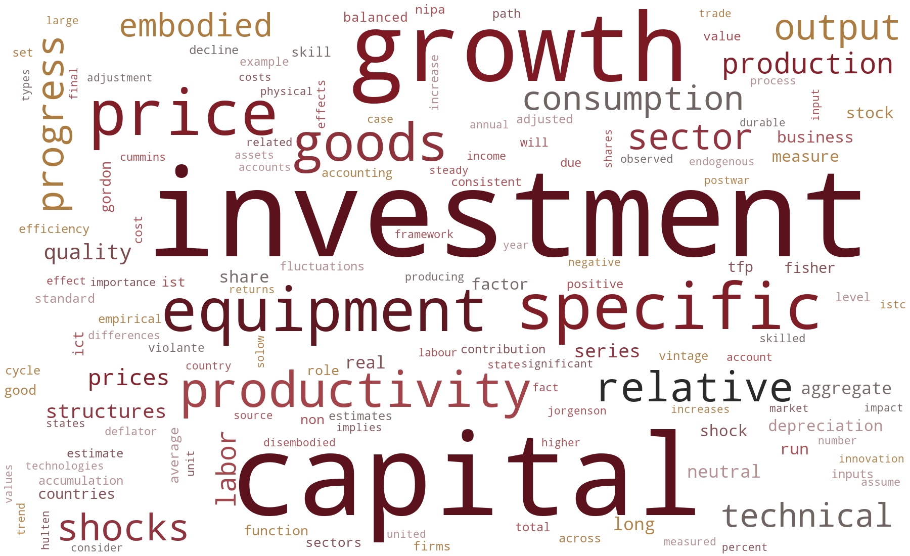

# GHK 1997 学界态度总结

> 数据来源：`GHK1997_被引文献PDF/GHK1997引用摘录_同段完整句版.md`。本文按当前文件中可解析的摘录条目统计；源文件顶部汇总写作 884 条、409 个 PDF，但当前可解析结果为 883 条引用语境、408 个去重 PDF。

## 1. 数据与统计口径

- **主口径**：按 PDF 文件名去重后的文章数，用于回答“多少篇、占比多少”。
- **辅助口径**：正文中提到 GHK 1997 的引用语境条目数，用于观察一篇文章内部反复使用 GHK 的程度。
- **领域判定**：优先依据标题、摘要、关键词；当信息不足时，再参考引用 GHK 的上下文和摘录文件中的引用类型。
- **分类边界**：每篇文章只归入一个主领域；`宏观冲击`偏冲击来源和识别，`经济波动`偏周期机制和波动结果。

## 2. 领域分布

| 领域 | 去重文章数 | 占比 | 引用语境数 | 典型文献 |
|---|---:|---:|---:|---|
| 经济增长 | 206 | 50.5% | 553 | ICT-specific technological change and productivity growth in the US: 1980-2004；The productivity paradox and the new economy: The Spanish case；Capital goods, measured TFP and growth: The case of Spain；China's catch-up to the US economy: decomposing TFP through investment-specific technology and human capital；Growth and technological progress in selected Pacific countries |
| 经济波动 | 31 | 7.6% | 44 | Investment-specific shocks and real business cycles in emerging economies: Evidence from Brazil；The price of imported capital and consumption fluctuations in emerging economies；Do business cycles, investment-specific technology shocks matter for stock returns?；Putty-Clay and Investment: A Business Cycle Analysis；Policy Risk and the Business Cycle |
| 结构转型 | 41 | 10.0% | 54 | Growth and Structural Transformation；Servicification of investment and structural transformation: The case of China；Structural Transformation of India: A Quantitative Analysis；Technology Trade in Economic Development；The Role of Manufacturing-specific Technology in Determining the Composition of Hours Worked in Korea |
| 宏观冲击 | 54 | 13.2% | 122 | Modeling Investment Sector Efficiency Shocks: When Does Disaggregation Matter?；The Dynamic Effects of Neutral and Investment-Specific Technology Shocks；Business cycle dynamics when neutral and investment-specific technology shocks are imperfectly observed；Investment Shocks and Asset Prices；Neutral Technology Shocks and the Dynamics of Labor Input |
| 其它 | 76 | 18.6% | 110 | What drives the skill premium: Technological change or demographic variation?；Labor supply with job assignment under balanced growth；Technology Shocks and Job Flows；The Replacement Problem in Frictional Economies: A Near-Equivalence Result；Unemployment vs. Mismatch of Talents: Reconsidering Unemployment Benefits |

总体上，GHK 1997 最常被放在**经济增长**问题中使用：后续文献借它讨论 investment-specific technological change、设备相对价格下降、资本质量改善和 TFP/产出增长分解。第二组重要用途是**宏观冲击**和**经济波动**：前者把 GHK 发展出的 ISTC 思路转化为可识别的 investment-specific technology shocks，后者将这些冲击放入 RBC/DSGE 或商业周期框架中检验其短期波动含义。**结构转型**类文献则把资本品技术进步、相对价格变化和部门间资源配置联系起来，用于解释产业结构、贸易和发展路径变化。`其它`收纳了劳动、不平等、资产价格、企业动态、校准和方法论等相对零散但仍然依赖 GHK 框架的应用。

词云图基于正文中提到 GHK 1997 的“同段完整语句”生成。图中字号越大，表示该词越常出现在后续文献评价、借用或定位 GHK 的语境中。

## 3. 这些文章在哪里提到和评价 GHK 1997

- **引言和文献综述位置最常见**：按页码粗略看，前 3 页出现 257 条引用语境，说明很多文章把 GHK 作为研究动机、经典文献或经验事实来源。
- **模型设定和机制说明中也很常见**：第 4-12 页出现 427 条引用语境，通常用于说明资本积累方程、资本品部门、相对价格如何进入模型，以及为什么要区分 neutral technology 与 investment-specific technology。
- **校准、数据构造和结果解释中反复出现**：第 13 页以后出现 199 条引用语境，常用于引用设备折旧率、资本份额、质量调整价格指数、长期增长贡献或对实证结果的解释。

按摘录文件中的引用功能分类，引用语境分布如下：

| 引用功能 | 引用语境数 | 占比 |
|---|---:|---:|
| 测量 ISTC / 相对价格 | 219 | 24.8% |
| 长期增长核算 / TFP 贡献 | 196 | 22.2% |
| 资本体现型技术 / vintage | 97 | 11.0% |
| 投资特定技术冲击 / 商业周期 | 91 | 10.3% |
| 模型设定 / 资本品部门 | 88 | 10.0% |
| 校准 / 参数取值 | 73 | 8.3% |
| 一般理论依据 | 64 | 7.2% |
| 文献定位 / 简短引用 | 55 | 6.2% |

这说明后续文献并不只是把 GHK 当作普通文献背景列举，而是经常在测量、增长核算、模型构造和冲击识别等核心环节调用它。

## 4. 主要引用 GHK 的哪些点

1. **用投资品相对价格度量 ISTC**：大量文献沿用 GHK 的核心识别直觉，即质量调整后的设备或投资品相对消费品价格下降，可以反映 investment-specific technological change。
2. **把技术进步理解为 embodied / vintage capital**：后续研究常把 GHK 放在 Solow vintage capital 传统之后，强调新资本品 embodies better technology，旧资本会因技术前沿推进而相对过时。
3. **长期增长核算中的量化贡献**：许多文章引用 GHK 关于 ISTC 对美国长期产出增长或 TFP 变化贡献很大的结论，用它说明传统 Solow residual 不能完整解释技术进步来源。
4. **把 ISTC 引入现代宏观波动模型**：RBC/DSGE 文献常把 GHK 作为 investment-specific technology shocks 的理论来源，随后讨论它对投资、产出、工时和资产价格的动态影响。
5. **资本品部门与资本积累方程的建模模板**：一些文章借用 GHK 的资本积累形式、设备/结构区分、相对价格路径和 balanced growth 条件。
6. **校准和经验基准**：后续文献在资本份额、设备折旧、结构折旧、质量调整价格序列或长期趋势矩上，经常把 GHK 作为基准参照。

## 5. 学界定位和主要贡献

GHK 1997 在学界的定位可以概括为：**它把 investment-specific technological change 从一个关于资本品质量的直觉，变成了可以被价格数据度量、可以放入一般均衡模型、也可以进入增长核算和商业周期分析的标准框架**。

它的贡献主要有四层。第一，GHK 把技术进步拆分为 neutral productivity 与 investment-specific technology，使宏观研究不再只把技术变化压缩进单一 TFP residual。第二，它把质量调整后的投资品相对价格作为识别 ISTC 的关键对象，建立了价格测量与技术进步之间的桥梁。第三，它说明 embodied technology 对长期增长可能有很大贡献，从而改变了后续增长核算和生产率研究对资本品质量的处理方式。第四，它为后来的 RBC/DSGE 文献提供了一个自然的冲击来源，使 investment-specific shocks 成为解释波动、投资动态、资产价格和劳动市场反应的重要工具。

从引用态度看，后续文献大多不是直接批评 GHK，而是把它作为**基准框架、测量来源和模型入口**来继承与扩展。争议和修正主要集中在三个方面：投资品相对价格是否完全等同于技术进步、不同资本类型和部门是否需要更细分、以及 ISTC 在长期增长和短期波动中的相对重要性。也正因为这些问题仍然存在，GHK 对今天关于 AI、无形资本、资本异质性、生产率放缓和结构转型的研究仍有启发：关键不只是“技术是否进步”，而是技术进步 embodied 在哪些资产中、如何被价格体系记录、又通过什么资本积累机制影响宏观结果。

## 6. 代表性引用方式速览

| 使用方式 | 典型含义 |
|---|---|
| 经典文献定位 | 把 GHK 列为 embodied technology / ISTC 文献的基础贡献。 |
| 测量依据 | 用质量调整投资品相对价格或其倒数构造 ISTC 指标。 |
| 增长贡献 | 引用 GHK 对美国长期增长贡献的量化结论。 |
| 模型来源 | 借鉴资本积累方程、资本品部门、balanced growth 设定。 |
| 冲击识别 | 将 ISTC 从长期趋势扩展为短期 investment-specific technology shocks。 |
| 校准基准 | 使用或对照 GHK 的资本份额、折旧率、设备/结构区分和长期趋势。 |

## 附：可复核的基础统计

- 当前可解析引用语境：883 条。
- 当前可解析去重 PDF：408 篇。
- 源文件顶部汇总：884 条正文命中、409 个 PDF；差异可能来自编号缺口或条目格式未被当前解析规则捕捉。
- 本文没有逐篇复述原文，而是围绕“后续文献如何使用和定位 GHK 1997”进行归纳。
